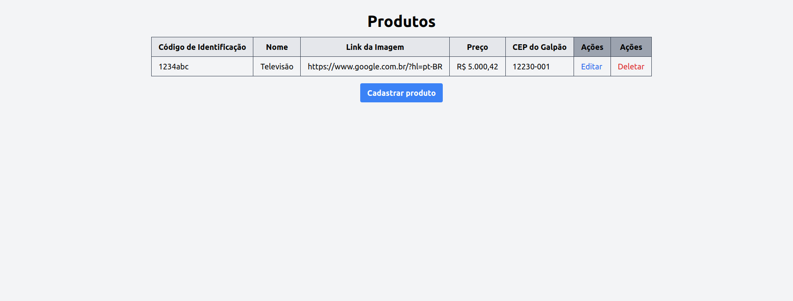
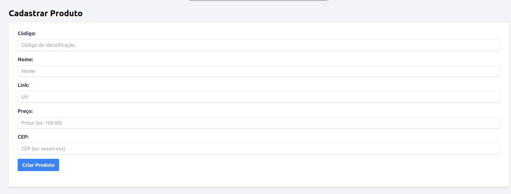
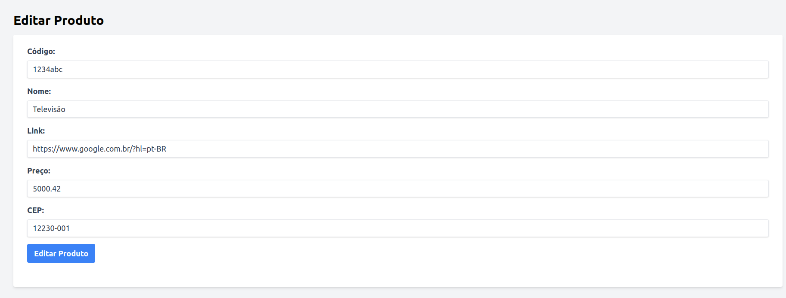

# CRUD - Laravel 10 (MKTP)
_Este projeto consiste em um CRUD desenvolvido em Laravel 10, com rotas de criação, listagem, edição e remoção de produtos. Em destaque, também contém integração com a api do ViaCep para identificação do bairro referente ao galpão em que o seu produto estará._ 

<table>
  <tr>
    <td align="center">
      
      <br />
      Página de listagem de produtos
    </td>
  </tr>
  <tr>
    <td align="center">
      
      <br />
      Página de cadastro
    </td>
  </tr>
  <tr>
    <td align="center">
      
      <br />
      Página de edição
    </td>
  </tr>
</table>

## Sobre o projeto
O CRUD consiste em uma API com as 4 possibilidades de tratamento, ou seja, podendo se criar, listar, editar ou remover produtos, juntamnete a um banco de dados. Além disso, ao inserir o CEP o bairro relacionado irá aparecer, de acordo com a api do ViaCep integrada no projeto.

Portanto, ele inclui:

- **Produtos** (`/products`) 
  - Criação:
    - Produtos podem ser cadastrados, seguindo os padrões de código de identificação, nome, link, preço e cep.

  - Listagem:
    - Todos os produtos criados podem ser vistos.

  - Edição:
    - Qualquer produto pode ser editado, seguindo as regras de cadastro.

  - Remoção:
    - Qualquer produto pode ser deletado, de forma única.
    

## Tecnologias

As tecnoligas abaixo, foram as utilizadas para desenvolver o projeto:

- 

- 

- 

- 

- 

- 

- 

## Como rodar para desenvolvimento

1. Clone este repositório
2. Instale todas as dependências

```bash
# para dependênicas do javascript
$ npm install

# para dependências do php
$ composer install
```

3. Crie um banco de dados MySQL, com o nome que desejar

4. Configure o arquivo `.env` usando o `.env.example` como base

5. Inicie o servidor, rodando os dois comandos de desenvolvimento:

```bash
# para rodar o servidor php
$ php artisan serve

# para rodar o vite (HTML, CSS e JS)
$ npm run dev
```

## Como rodar os testes

1. Rode o comando abaixo:

```bash
$ php artisan test
```

## Code of Conduct

In order to ensure that the Laravel community is welcoming to all, please review and abide by the [Code of Conduct](https://laravel.com/docs/contributions#code-of-conduct).

## Security Vulnerabilities

If you discover a security vulnerability within Laravel, please send an e-mail to Taylor Otwell via [taylor@laravel.com](mailto:taylor@laravel.com). All security vulnerabilities will be promptly addressed.

## License

The Laravel framework is open-sourced software licensed under the [MIT license](https://opensource.org/licenses/MIT).
